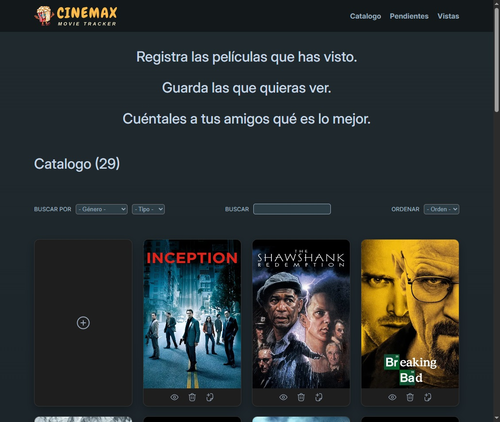
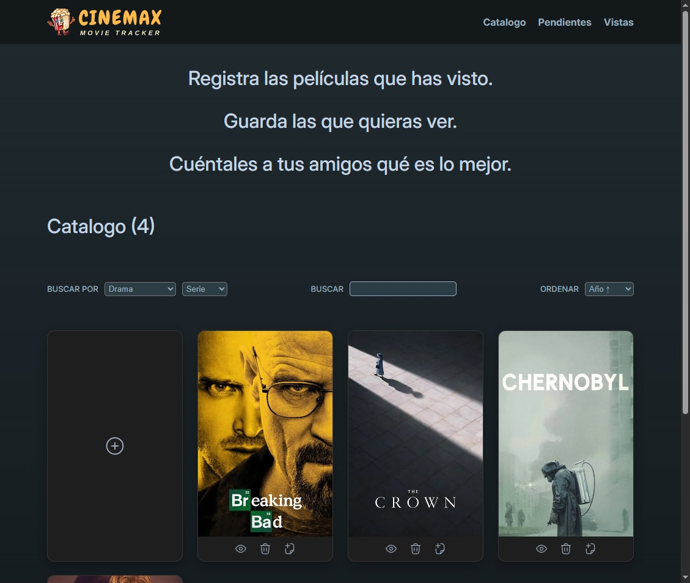
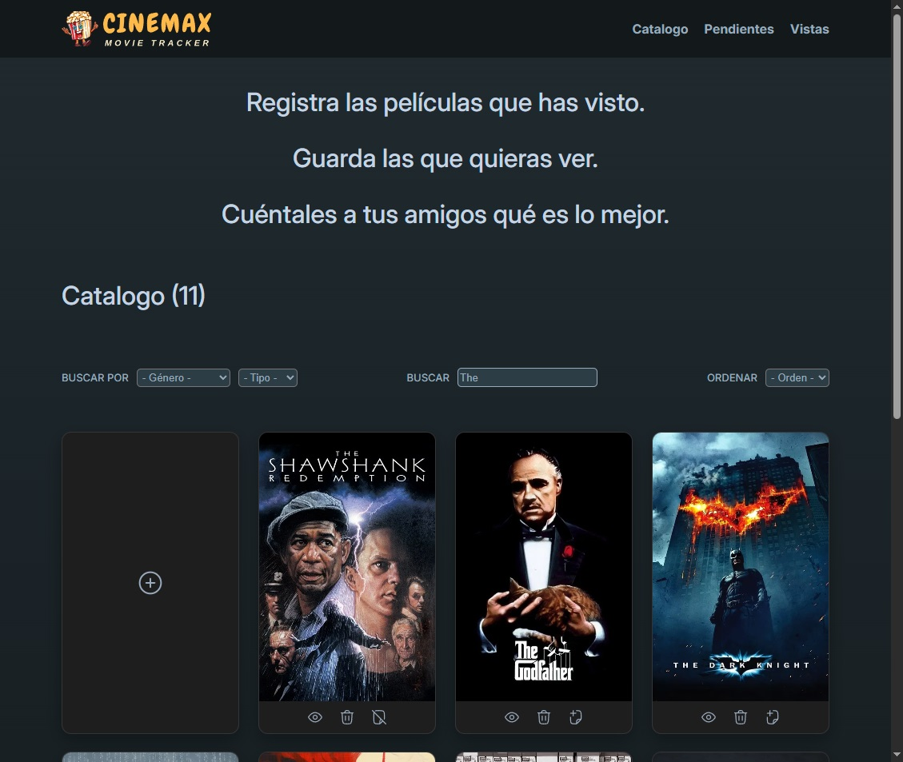
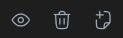
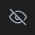
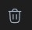
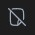
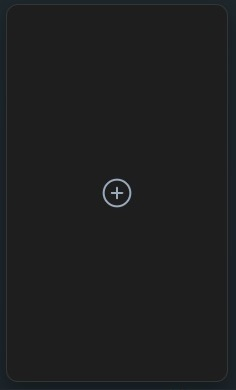
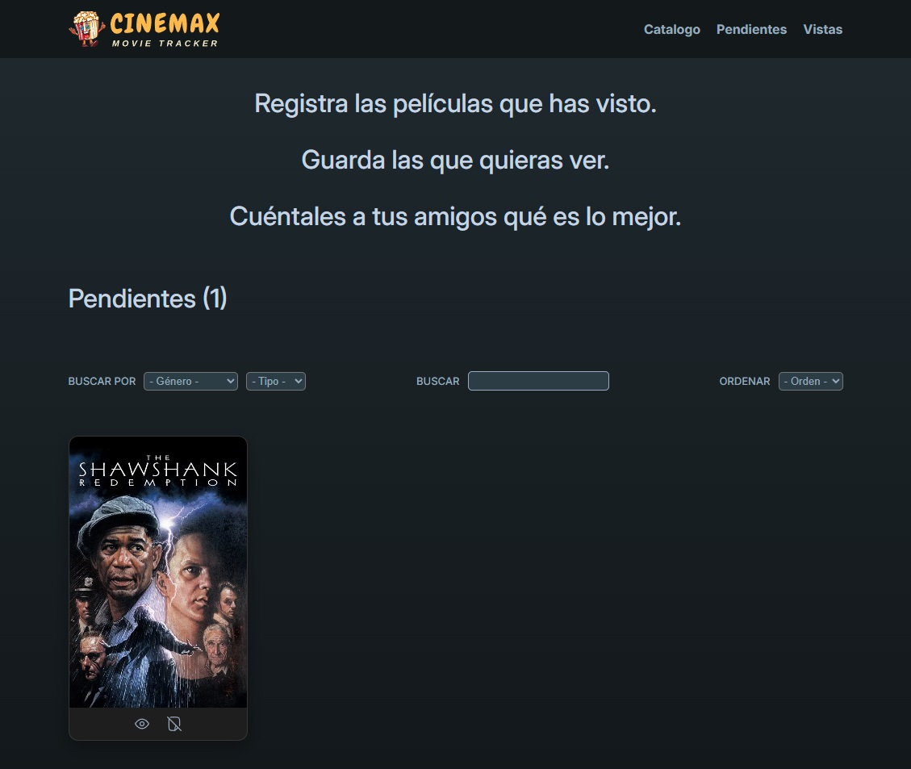
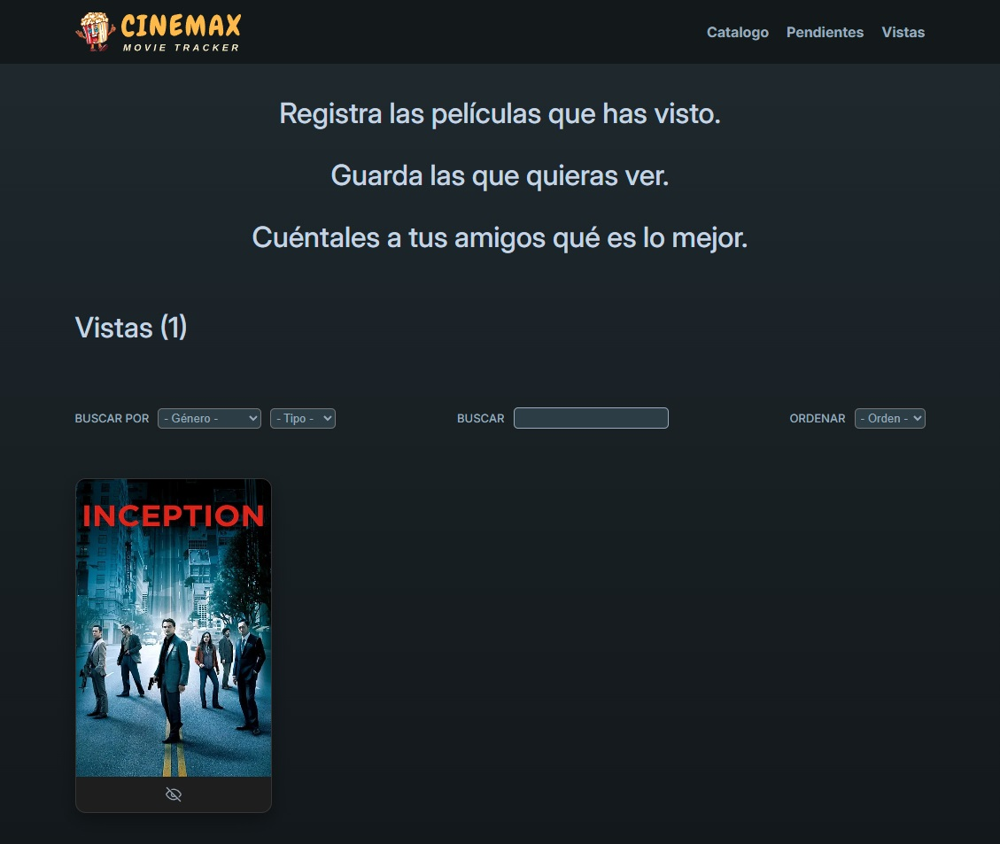

# Programacion Web Avanazada - 2025

## <strong>Trabajo Práctico: REACT


## Integrantes


- [FAI-3169] Benitez, Franco Fabian
- [FAI-4594] Pesce, Matías Nicolás
- [FAI-3220] Reyes Castelló, José Vicente


## Enlace a versión web 

- https://react-tps-5zs5.vercel.app/

## Descripción


Cinemax Movie Tracker es una aplicación diseñada para poder llevar un registro de las películas y series que has visto y todas aquellas que te quedan por poder disfrutar. Podes calificarlas según tus gustos, filtrarlas por su género y ordenarlas por nombre, su año de emisión o calificación, y siempre pudiendo agregar todas las que quieras a tu repertorio.


## Guia de instalación y visualización del proyecto
### Requisitos

- Tener instalado [Node.js](https://nodejs.org/)

### Instalación

1) Clonar el repositorio con el siguiente comando:

```bash
git clone https://github.com/Niicoph/react-tps.git
```

2) Abrir la terminal en el directorio _/react-tps_ e ingresar el siguiente comando:

```bash
npm install
```

En caso de que ocurra el siguiente error para usuarios que utilicen PowerShell:

```bash
npm : No se puede cargar el archivo ...\NodeJS\npm.ps1 porque la ejecución de scripts está deshabilitada en este sistema. Para obtener más información, consulta el tema about_Execution_Policies en 
https:/go.microsoft.com/fwlink/?LinkID=135170.
En línea: 1 Carácter: 1
+ npm -v
+ ~~~
    + CategoryInfo          : SecurityError: (:) [], PSSecurityException
    + FullyQualifiedErrorId : UnauthorizedAccess
```

Se puede solucionar ejecutando la terminal en modo administrador (PowerShell o Símbolo de Sistema) e ingresando el siguiente comando:

```bash
Set-ExecutionPolicy RemoteSigned
```

Para confirmar el cambio ejecute en la terminal el comando:

```bash
npm -v
```

Si le devuelve la versión actual del mismo significa que ya puede volver a correr el comando inicial

### Visualización

1) Luego de realizada la instalación, abrir la terminal en el directorio _/react-tps_ e ingresar el siguiente comando:

```bash
npm run dev
```

La terminal retornará el siguiente texto:
```bash
> react-tps@0.0.0 dev
> vite


  VITE v6.2.6  ready in 1804 ms

  ➜  Local:   http://localhost:5173/
  ➜  Network: use --host to expose
  ➜  press h + enter to show help
```

Copiar la URL que figura en local, en este caso:
```bash
http://localhost:5173/
```

2) Ingresar en su navegador web ingresar la URL copiada y comienze a navegar por el proyecto.

## Tutorial de uso
### Home
#### Al ingresar se encontrará con el catálogo de películas

<br>

> El listado précargado de películas está configurado de forma que si todas se borran, vuelva a cargarse al refrescar la página.

#### Puede filtrar por género y tipo de obra como también ordenarlas por nombre, año o calificación, combinandolos para una mejor personalización



#### O también buscar por nombre



#### Cada obra en el catálogo tiene tres opciones 
 

#### El ícono de vista, que al seleccionarlo le solicita calíficar la película 

#### 

Y que luego de confirmar su obra se agrega a su pestaña de Vistas, lo identificará al ver el cambio en el ícono 



#### El ícono de borrar, con él removerá la obra del catálogo (y cuidado, también lo quitará de Pendientes y Vistas) 



#### Y por último el ícono de pendiente, con el que la obra se agrega a su pestaña de Pendientes, que también cambia para ayudarlo 



#### Pero si esas obras no son suficientes siempre puede agregar más a su catálogo haciendo click en la tarjeta



Y le va a solicitar la información de su obra (y recuerde que tiene que elegir una categoría y un tipo)

 <br>
> Debe completar todos los campos además de elegir un `Género` y un `Tipo`

#### Ahora ya puede comenzar a organizar sus obras preferidas

### Pendientes

#### Aquí puede ver todas las obras que todavía no ha podido terminar


### Vistas
Y también llevar un registro de las obras que ya ha podido disfrutar



> Siempre puede cambiar la calificación de cualquier obra tocando su ícono de vista, pero cuidado, si la misma es de `0` dejará de estar presente en esta pestaña, pero no se preocupe que la va a poder encontrar en su catálogo.

## Consignas a responder

1) **Explicar la función de los siguientes archivos iniciales: index.js, App.js, index.css y package-json.js.**

- Index.js (o Main.jsx): Es el archivo en el cual React se conecta con el DOM del navegador, el mismo cumple con la función de importar React para permitir el uso de archivos JSX, React-dom para el renderizado en el navegador, el archivo App.js (o App.jsx) como componente principal, index.css como estilos globales. También es el encargado de renderizar el componente principal dentro archivo index.html en el elemento con el id "root".

- App.js (o App.jsx): Este archivo contiene el componente principal de React y tiene la función de contener la lógica y composición de otros componentes, funcionando además como primer nivel de la estructura de árbol de los componentes y punto de organización de la interfaz del usuario.

- index.css: En este archivo se insertan los estilos de visualización que son aplicados de manera global, tales como fuentes, fondos o márgenes del navegador.

- package-json.js: Es el archivo de configuración del proyecto, cumple un rol fundamental y entre sus funciones está la de contener la información del proyecto, sus dependencias, scripts y cualquier otra configuración adicional que sea necesaria.
